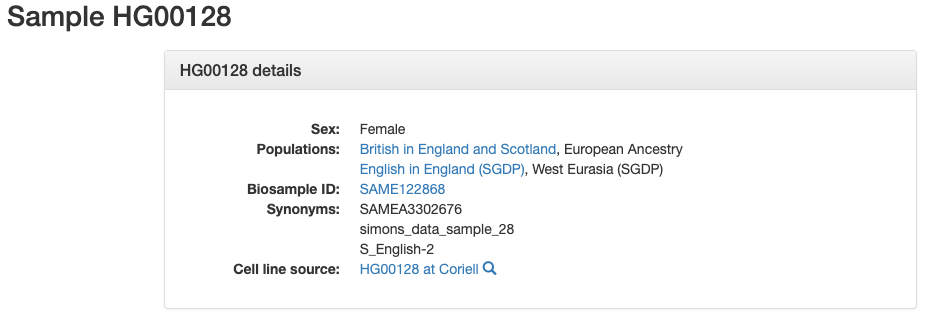
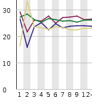
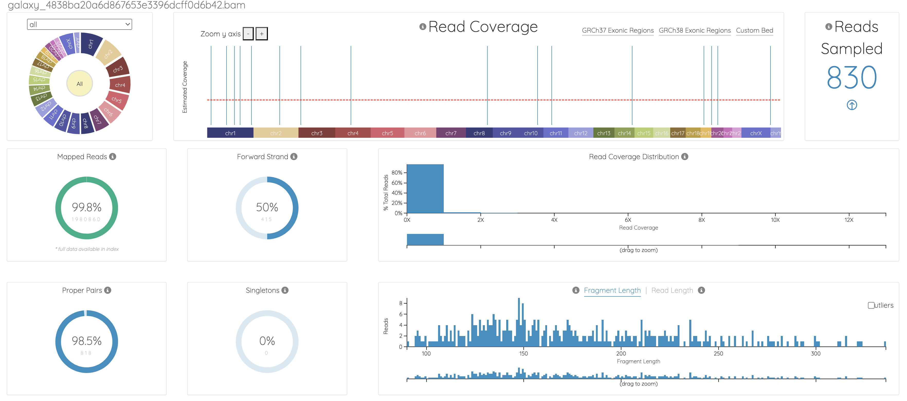

# TAULA DE CONTINGUTS

-   [ABSTRACT](#abstract)
-   [OBJECTIUS DE L'ESTUDI](#objectius-de-lestudi)
-   [MATERIALS I MÈTODES](#materials-i-mètodes)
-   [RESULTATS](#resultats)
-   [DISCUSSIÓ I LIMITACIONS](#discussió-i-limitacions)
-   [CONCLUSIONS](#conclusions)
-   [APÈNDIX](#apèndix)
    -   [INFORMACIÓ PRÈVIA DE LES DADES (1000 genomes)](#informació-prèvia-de-les-dades-1000-genomes)
    -   [PLATAFORMA GALAXY](#plataforma-galaxy)
        -   [CÀRREGA I PREPROCESSAMENT DE LES DADES](#càrrega-i-preprocessament-de-les-dades)
        -   [AVALUACIÓ I CONTROL DE QUALITAT DE LES LECTURES](#avaluació-i-control-de-qualitat-de-les-lectures)
        -   [ALINEACIÓ DE LES SEQÜÈNCIES AL GENOMA DE REFERÈNCIA](#alineació-de-les-seqüències-al-genoma-de-referència)
        -   [IDENTIFICACIÓ DE DIFERÈNCIES GENÈTIQUES ENTRE LES LECTURES ALINEADES I EL GENOMA DE REFERÈNCIA](#identificació-de-diferències-genètiques-entre-les-lectures-alineades-i-el-genoma-de-referència)
        -   [VISUALITZACIÓ DELS RESULTATS INTERMEDIS AMB UN NAVEGADOR GENÒMIC](#visualització-dels-resultats-intermedis-amb-un-navegador-genòmic)
        -   [FILTRATGE I ANOTACIÓ DE VARIANTS GENÈTIQUES](#filtratge-i-anotació-de-variants-genètiques)

## ABSTRACT {#abstract}

Aquest anàlisi pretén identificar variants genètiques d’una mostra genòmica humana del projecte 1000 Genomes, específicament de dades obtingudes de limfòcits B. L’objectiu principal és identificar variants minoritàries, incloent SNVs (Single Nucleotide Variants) i indels (insercions i delecions), a través de la plataforma Galaxy.

Tots els resultats obtinguts de la plataforma estan disponibles al repositori de github <https://github.com/acniell/PEC3_omiques.git>.

El flux de treball realitzat a Galaxy (pipeline) ha inclós un control de qualitat de les dades amb les que s'ha treballat, l'alineament (*mapping*) amb al genoma de referència (hg38), la identificació de variants i filtratge d'aquestes i anotació funcional. També s'han visualitzat els resultats preliminars obtinguts amb el visor genòmic UCSC Genome Browser.

S'han identificat un total de 16.991 variants, de les quals un petit percentatge presenten un impacte biològic elevat (2,89%). Aquestes variants inclouen canvis missense i nonsense que podrien afectar l’estructura o funció de proteïnes, així com alteracions en regions reguladores que podrien tenir efectes transcripcionals. també cal destacar que s'han trobat un 35,30% de variants exòniques i 50,83% d'intròniques.

Aquest anàlisi ha permès identificar un conjunt de variants que podrien estar potencialment relacionades amb malalties o processos biològics rellevants. Això constitueix una base preliminar prometedora per a futures investigacions, que podrien aprofundir en la seva caracterització funcional i explorar les seves implicacions en el context de la salut humana i la genòmica clínica.

## OBJECTIUS DE L'ESTUDI {#objectius-de-lestudi}

L'objectiu d'aquest anàlisi és detectar la presència de variants com ara *single nucleotide variants (SNPs)* i insercions i delecions (*indels*) en un conjunt de dades genòmiques simplificades (facilitades per la Universitat Oberta de Catalunya) del projecte *1000 Genomes*; així com identificar la seva localització i potencial implicació en processos biològics o malalties.

Addicionalment, aquesta anàlisi té com a objectiu la familiarització de l'usuari en un fluxe de treball complet amb amb plataformes especialitzades com Galaxy.

## MATERIALS I MÈTODES {#materials-i-mètodes}

Aquest anàlisi s'ha realitzat utilitzant un conjunt de dades genòmiques derivades del projecte *1000 Genomes*, específicament de la mostra HG00128, que prové de limfòcits B humans (veure apèndix). Les dades s'han processat a la plataforma *Galaxy*, implementant un *pipeline* estàndard i suggerit a l'assignatura d'anàlisi de dades òmiques.

Aquest flux de treball ha consisit en aplicar un control de qualitat de les dades de seqüenciació a través de *FastQC* (imatge 5). En base als resultats, s'ha aplicat un *trimming* (retallada) de les lectures de baixa qualitat. Aquest procés s'ha realitzat amb *Cutadapt* i posteriorment s'ha realitzat un nou control de qualitat.

Posteriorment, s'ha procedit a l'alineament de seqüències amb el genoma de referència, *hg38*. Aquest alineament s'ha realitzat amb l'eina *Bowtie2*, la qual genera un arxiu BAM que conté les lectures alineades i estadístiques del procés (Imatge 12). S'han visualitzat els resultats d'aquest procés al navegador *UCSC Genome Browser* (Imatge 14).

Un cop alineades, s'han identificat les variants genètiques utilitzant *FreeBayes.* S'han simplificat els resultats de la identificació *VcfAllelicPrimitives*, amb la finalitat de descomposar variants complexes en variants més senzilles. S'ha procedit a un filtrat de les dades en funció de la qualitat de les variants, mantenint únicament aquelles amb un *QUAL* superior a 30 (Imatge 15).

Per a l’anotació funcional de les variants identificades, s'a utilitzat *SnpEff*. Aquesta eina ens ha permès classificar les variants segons el seu impacte biològic i localització genòmica (Imatge 17-19).

Aquest flux de treball ens ha permès l’anàlisi i anotació detallada de variants genètiques d’una mostra genòmica humana, proporcionant una base sòlida per a futures investigacions.

Globalment, aquest flux de treball queda recollit i il·lustrat a l’apèndix amb figures descriptives de cada etapa, i els fitxers resultats es poden trobar al repositori de github <https://github.com/acniell/PEC3_omiques.git>.

## RESULTATS {#resultats}

S'han identificat un total de 16.991 variants. Pel que fa la densitat de variants, suposa una taxa mitjana d’aparició d’una variant cada 178.520 bases del genoma, concordant amb la literatura del genoma humà.

Pel que fa a la distribució de variants, un 50,83% s'ha localitzat en regions intròniques, resultat esperable donada la major representació d’aquestes regions al genoma humà. Tot i així, una part destacable (**35,30%**) de les variants s'han detectat a regions exòniques, les quals són altament rellevants ja que contenen informació codificant de proteïnes. Aquesta informació es troba parcialment visible a les imatges 16-18, i el la totalitat del resultat es troba a repositori de github.

Pel que fa a l'impacte funcional, un 2,89% de les variants tenen un impacte alt, potencialment relacionat amb alteracions crítiques en la funció de les proteïnes. Tanmateix, un 45,29% de les variants són tipus missense, que podrien suposar modificacions en la seqüència d’aminoàcids que podrien afectar la funció proteica. En últim lloc, s'han identificat un 0,49% de variants nonsense, que poden tenir un impacte potencialment molt greu en la funcionalitat o síntesi proteica.

Finalment, l'anàlisi ens facilita dues taules detallades de canvis de codons i aminoàcids d'aquestes variacions, oferint una visió global de com aquestes poden alterar la funcionalitat de les proteïnes codificades.

## DISCUSSIÓ I LIMITACIONS {#discussió-i-limitacions}

Els resultats mostren que la major part de les variants identificades tenen un impacte moderat o baix.\
Caldria analitzar més profundament i buscar correlació clínica amb les variants que presenten un impacte alt o que es localitzen en regions exòniques. Les variants missense representen una fracció important de les troballes que podrien tenir una gran implicació en la disfunció proteica, i per tant en malalties.

Tanmateix, cal no oblidar les variants intròniques ja que poden influir en la regulació de l'expressió gènica (regions reguladores o alteració de *splicing*).

Pel que fa al processat de les dades, un aspecte que crida l’atenció és l’absència de variants conegudes al fitxer VCF generat, pel que és possible que hi hagi algun error al *pipeline* o de la configuració dels filtres aplicats. Caldria la revisió per un usuari més experimentat i familiaritzat en l'àmbit i plataforma per corroborar els resultats i garantir fiabilitat.

## CONCLUSIONS {#conclusions}

Aquest estudi ha permès identificar i caracteritzar variants genètiques d’una mostra humana del projecte 1000 Genomes, destacant un 2,89% de variants amb alt impacte biològic, especialment en regions exòniques (35,30%). Tot i que les variants intròniques (50,83%) no codifiquen directament proteïnes, podrien influir en mecanismes com el splicing o la regulació gènica i per tant també són un font d'interès.

Tot i alguna limitació tècnica en el pipeline, aquest anàlisi evidencia el potencial dels fluxos de treball bioinformàtics per aprofundir en la comprensió de les bases genètiques de diverses condicions mèdiques i fomentar avenços en la medicina genòmica personalitzada.

# APÈNDIX {#apèndix}

En aquest apèndix està detallat tot el procés realitzat en aquesta PEC de manera més extensa, afegint imatges per a facilitar la comprensió del procés.

## INFORMACIÓ PRÈVIA DE LES DADES (1000 genomes) {#informació-prèvia-de-les-dades-1000-genomes}

Amb la informació de la introducció de la PEC primer hem entrat al portal de 1000 genomes i he buscat informació sobre la mostra amb la que treballarem. Si entrem a dins la fitxa trobem que la mostra prové d'humans i limfòcits B, per tant tractarem amb sistema immune.

{width="335"}

{width="365"}

A través del link proporcionat per l'activitat accedim a la carpeta amb les dades, de les quals agafarem les mostres aparellades número 6.

## PLATAFORMA GALAXY {#plataforma-galaxy}

### 1. CÀRREGA I PREPROCESSAMENT DE LES DADES {#càrrega-i-preprocessament-de-les-dades}

Per fer la nostra anàlisi procedim a carregar les dades a la plataforma Galaxy. Les pugem localment des del nostre ordinador.

{width="511"}

Examinem els nostres fitxers FASTQ amb les seves 4 línies típiques:

-   La primera línia que és l'identificador de la seqüència

-   Tot seguit tenim la seqüència

-   La tercera línia que sempre comença amb el signe + i pot contenir o no informació (la informació de la primera línia).

-   Els valors de qualitat de la seqüència base a base.

{width="860"}

Tot seguir apliquem l'eina *FastQC* que ens generarà un informe de la qualitat de les dades, i per tant veurem si hem d'eliminar algunes dades.

{width="522"}

### 2. AVALUACIÓ I CONTROL DE QUALITAT DE LES LECTURES {#avaluació-i-control-de-qualitat-de-les-lectures}

Una vegada executat veiem que ens genera l'informe de qualitat per a cada un dels fitxers, i a més, també ens genera un output de dades raw per si es volen importar i analitzar fora de l'entorn galaxy.

{width="257"}

Els informes HTML generats es poden consultar al repositori de github <https://github.com/acniell/PEC3_omiques>.

Amb el primer informe podem observar que globalment la qualitat de les dades és molt correcta. Tot i així, com passa de forma habitual, seria recomanable retallar la part final, ja que el primer gràfic (*per base sequence quality*), veiem que hi ha una caiguda de l'índex de phred fins a pràcticament àrea vermella. En base als resultats, eliminaríem les 5-7 últimes bases aproximadament.

A la gràfica de *per base sequence content" v*eiem que també hi ha variació al principi (les primeres 10 bases aproximadament) tot i que és poca, i posteriorment queden molt equilibrades.

De l'índex de resultats, també veiem que ens avisa que l'apartat *per sequence GC content* no és del tot correcte: la distribució de GC varia lleugerament entre la nostra i la teòrica esperada. Al ser l'únic resultat de moment alterat, no prendrem cap acció al respecte però és un toc d'avís si veiem que alguna cosa no ens quadra.

El segon veiem que ens mostra una qualitat inferior de les dades: al primer gràfic (*per base sequence quality*) ja veiem que tant a l'inici com al final tenim una caiguda de les distribucions del Phred quality score, pel que hauríem de valorar una retallada *(trim)* dels extrems. Tot i així, globalment la qualitat de les dades és bona, majoritàriament estan a l'àrea verda.

El plot blau (*per tile sequence quality*), específic per a *illumina*, ens mostra blaves les regions d'alta qualitat, i amb colors càlids les de regions de més baixa (el pitjor, el vermell). Al nostre gràfic veiem que hi ha problemes a les primeres posicions de *tile* 2215 a 2201.

A la gràfica de *per base sequence content* veiem que també hi ha més variació al principi (fins la base número 10 aproximadament) però que posteriorment la relació entre els diferents nucleòtids està molt ben balancejada. També ho vèiem a l'informe de primer fitxer.

Per tant, en base als resultats, farem un *trimming* de 10 bases finals. A més, establirem un llindar de qualitat de 20. Existeixen diferent eines per a la realització, com ara *chromatic o cutadapt*. Farem servir la segona:

{width="146"}

Una vegada fet el procés, he canviat noms per treballar més còmodament i tornarem a aplicar *FastQC*. Aquesta vegada els resultats *(de nou, disponible en format PDF a github amb el nom Dades1CUT i Dades2CUT)* milloren a la zona final però encara persisteix una qualitat pobra de les lectures a l'inici de les dades2, tot i que a dades1 la qualitat és excel·lent. Eliminarem les 3 primeres bases a ambdues lectures (dades1 i dades2), que hauria de suposar una pèrdua mínima d'informació i guanyaríem qualitat globalment. Anem a repetir el procés amb *cutadapt*, i fer aquest segon *trim.*

{width="454"}

Per últim tornem a aplicar *FastQC* per a veure quina qualitat té el resultat final, que és molt correcta en ambdós *(informes disponibles amb el nom Dades1_def i Dades2_def)*.

### 3. ALINEACIÓ DE LES SEQÜÈNCIES AL GENOMA DE REFERÈNCIA {#alineació-de-les-seqüències-al-genoma-de-referència}

Per procedir amb el mapping farem servir l'eina Bowtie2 (tutorial d'ús disponible a <https://galaxyproject.github.io/training-material/topics/sequence-analysis/tutorials/mapping/tutorial.html>).

Farem servir per l'alineació Hg38.

*Bowtie2* ens genera dos output: *alignments i mapping stats*. El primer ens mostra quines lectures s'han alineat, on es troben del genoma de referència, etc; el segon ens dóna les estadístiques de quantes lectures tenim, quantes correctament alineades o amb alineament múltiples, així com les que no s'han alineat. El resultat total està disponible a github.

El fitxer BAM té l'aspecte següent:

{width="547"}

{width="547"}

Tenim una capçalera amb metadades, seguit de la taula amb les característiques de l'alineamnet de les lectures. Si fem un scroll ràpid veurem que gran part està localitzat al cromosoma 1, tot i que també ens apareixen la resta de cromosomes (1, 10, 11, 12, 13... fins i tot X i Y)

Si agafem les estadístiques final veiem que:

{width="368"}

Hem fet un total de 992,175 lectures i totes estan aparellades (no hi ha hagut errors en el *trimming*; es podria haver quedat més curta per exemple si ho haguéssim fet malalment).\
A partir d'aquí veiem tres resultats:

-   Alineament concordant: Un 72.75% de les lectures s'han alineat en un sol lloc del genoma de referència, el 25.83% en més d'un i el 1.42% a cap.

-   Alineament discordant: 14100 parelles. D'aquestes, 62.45% s'han alineat no respectant la distància esperada o orientació.

-   Sense cap alineament: 5.295 no s'han alineat.

Globalment veiem que el 99.82% de les lectures s'han alineat.

Si volem veure una representació més visual i interactiva dels nostres resultats amb *Bowtie2*, tenim l'opció d'accedir a la plataforma bam.iobio. Tot seguit hi ha una imatge d'aquesta.

Per acabar de veure amb més detall el resultat del nostre *mapping* (com ara distribució de les posicions) podem fer servir *Samtools Stats*.

En aquest cas l'hem aplicat i el fitxer generat també està disponible a github per a consulta (*Samtools_Stats.tabular*).

Del primer apartat ens fa una descripció general del nombre total de seqüències, quantes lectures mapejades tenim i quantes no, etc. A més també ens diu a mode resum la longitud mitjana de les lectures i la qualitat d'aquestes (de mitjana 37.2 Phred).\
Dels resultats anteriors veiem que hi ha la possibilitat de tenir un alineament discordant, i és a l'output de samtools on veiem quants parells de lectures no tenen l'orientació esperada per exemple (8.733).\
Posteriorment tenim les *FFQ i LFQ* (*first and last fragment qualities*) per a cada base, que es mantenen altes globalment.

Per últim tenim les mismatches, que venen a ser els errors, i que també són pocs ja que tenim dades d'alta qualitat (Phred).

### 4. IDENTIFICACIÓ DE DIFERÈNCIES GENÈTIQUES ENTRE LES LECTURES ALINEADES I EL GENOMA DE REFERÈNCIA {#identificació-de-diferències-genètiques-entre-les-lectures-alineades-i-el-genoma-de-referència}

Ja hem obtingut el nostre fitxer BAM amb el processat que ha fet *Bowtie2*. Per procedir amb la detecció de variants, farem servir *FreeBayes*. Per configurar l'eina m'he basat amb el tutorial de *Galaxy* (<https://training.galaxyproject.org/training-material/topics/variant-analysis/tutorials/dip/tutorial.html>)

Igual que a l'apartat anterior, comparem les lectures amb Hg38.\
Aquesta eina ens genera un fitxer VCF que si visualitzem a *Galaxy* veiem que tenim una primera part amb les metadades i posteriorment una taula amb totes les variants detectades. La taula ens mostra el cromosoma, posició, quina és la referència del genoma i quina és l'alternativa que hem detectat, la qualitat d'aquesta variant, etc.

Abans de continuar i filtrar variants, farem servir l'eina *VcfAllelicPrimitives* per dividir variants compostes en vàries d'independents.

Els arxius resultants tant de *FreeBayes* com *VcfAllelicPrimitives* estan disponibles a les carpetes corresponents de github. L'arxiu resultant és molt similar a l'anterior però amb més entrades. Veiem que tenim la columna de chrom (totes les entrades són del cromosoma 1), pos (la posició on es troba dins del cromosoma), identificació de la variant si en té, l'al·lel de referència i l'alternatiu, qualitat de la detecció de la variant i una columna amb informació respecte la variant. Revisant la llista veiem que la gran majoria són canvis d'una base per una altra (tipus SNPs). També hi ha algunes delecions com ara a chr1 pos 48187805, on tenim CCCAAG com a ref i alt només C (entre d'altres). A llista posició 31433042 tenim una inserció (ref A i alt ACAG). La llista de resultat és molt llarg, amb 28098 entrades.

### 5. VISUALITZACIÓ DELS RESULTATS INTERMEDIS AMB UN NAVEGADOR GENÒMIC {#visualització-dels-resultats-intermedis-amb-un-navegador-genòmic}

Fer una representació global de tots els resultats obtinguts és impossible ja que hi ha coincidències en molts cromosomes. En aquest cas, hem agafat la regió chr1:14542-248682198 i hem obert la pista a UCSC. El resultat és la següent imatge:

En aquesta imatge veiem la pista de *RefSeq* i la nostra carregada amb resultats de *Bowtie2* que és l'alineament (el color marró), que mostra una bona cobertura. Si a més a més afegim la pista de *VcfAllelePrimitives* veurem:

Veiem desglossades totes les seqüències alineades i ens apareix marcat en color vermell allà on és diferent del nostre genoma de referència. Les bases tenen diferent color per a facilitar la interpretació visual.\
Quan tenim guions, això pot representar delecions o bé insercions. Si cliquem sobre d'un se'ns obre un quadre on veiem més detallament aquesta informació:

{width="264"}

### 6. FILTRATGE I ANOTACIÓ DE VARIANTS GENÈTIQUES {#filtratge-i-anotació-de-variants-genètiques}

Hem vist que tenim una quantitat d'informació descomunal, per tant ara toca filtrar-la i quedar-nos amb la que ens pugui enriquir més i ser prou rellevant. Filtrarem per la qualitat (columna de *Qual* al nostre fitxer VCF). En aquest cas farem servir un valor de tall de 30. Això ho farem amb *SnpSift Filter.*

L'arxiu resultant també és un VCF però que quan revisem els resultats, tenim únicament els que tenen QUAL\>30. El fitxer vcf generat està diponible a github a la carpeta filtrat.

Tot seguit passem a la part d'anotació, que farem servir *SnpEff.* Ens genera com a resultat un fitxer html i un vcf. Ara veurem els resultats de HTML, es pot trobar el fitxer a github dins la carpeta de *SnpEff.*

A la part més inicial tenim un resum (summary) on podem veure la informació general (genoma, versió SnpEff), ens avisa de 912 warnings però 0 errors.

En total s'han processat 16.991 variants però ens diu que cap coneguda. Això molesta però no sé si hi ha un error de processat.\
Tot seguit se'ns mostra una taula resum on veiem detalladament les variants de cada cromosoma i les seves característiques com llargada i densitat de variants. El que més en presenta és el cromosoma 1.

A la següent veiem desglossat els tipus de variants identificades: 16186 SNPs, 400 INS i 404 DEL.\
Amb aquesta informació, podem veure que a les següents taules l'informe ens facilita una estadística de l'impacte biològic de les variants que hem trobat: un petit percentatge tenen un alt impacte (2,89%) biològic (alteren l'estructura o funció de la proteïna). Existeix la categoria de "modifier" que són variacions de les qual desconeixem l'efecte o que bé són neutres; representa el 62,87% de les troballes.

{width="258"}

De les variacions que sí generen alteracions, veiem que el 45,29% són MISSENSE, un 0,49% NONSENSE (és la que té conseqüències més fatals ja que trunca el resultat) i un 54,22% són silents.

Per tant, veient els resultats, la gran majoria de variants tenen poc impacte, però sí que hi ha un petit percentatge que poden causar canvis més dràstics i que seria el grup on focalitzar.

A continuació tenim dues taules que ens monstren el tipus d'efecte que tenen les variants (a la primera taula la majoria són variants intròniques) i els efectes segons la regió afectada.\
A la segona taulta veiem que el 50,83% són variants que es troben als introns però el 35,30% estan a regions exòniques.

{width="447"}

La qualitat global té una mitjana de 77,223 i el valor mínim és de 30, que és el llindar que havíem establert, tot i que hi ha una alta variabilitat en la qualitat.

A més, ens ofereix un resum dels indels i dels SNPs.

Finalment ens mostra un taula on veiem els canvis de codo en les variants que hem analitzat, així com el canvi d'aminoàcids també.

{width="386"}

Per tant, en resum tenim un 2,89% de variants amb un gran impacte (funcional o estructural) i un 35,30% que es troben en exons, que pot tenir un impacte funcional directe en les proteïnes. Aquestes variants són en part amb les que caldria focalitzar-se ja que poden estar associades a malalties.

Tot i així, les que es troben en zones intròniques també és important tenir-les presents ja que poden afectar a la regulació de la transcripció.
